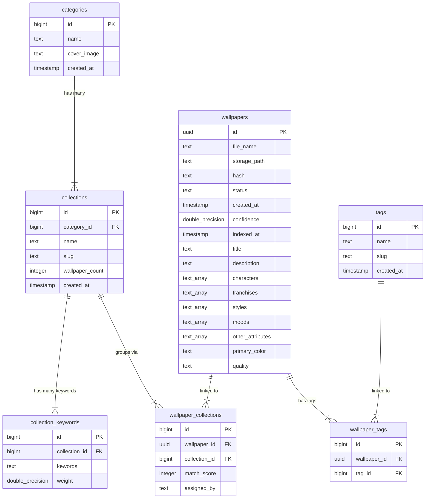

# Supabase Database Schema & Relations

This document details the database schema and normalization rules used by the Wallpaper Sync Server API (`web/`). 

---

## Entity Relationship Diagram



---

## Database Tables

### 1. `categories`
Stores the high-level classifications for wallpapers.
* `id` (bigint, Primary Key): Unique category identifier.
* `name` (text, Unique): Human-readable name (e.g. "Anime", "Landscapes", "Space").
* `cover_image` (text, Nullable): URL path to the cover image representing the category.
* `created_at` (timestamp with time zone): Creation timestamp.

### 2. `collections`
Groups wallpapers under specific categories.
* `id` (bigint, Primary Key): Unique collection identifier.
* `category_id` (bigint, Foreign Key -> `categories.id`): Nested category mapping.
* `name` (text): Collection title (e.g., "Naruto", "Cyberpunk 2077").
* `slug` (text): URL-friendly string representing the collection.
* `wallpaper_count` (integer): Cached total count of matched wallpapers.
* `created_at` (timestamp with time zone): Creation timestamp.

### 3. `collection_keywords`
Keyword tags used by the AI/matching engine to map wallpapers to collections.
* `id` (bigint, Primary Key): Unique keyword record identifier.
* `collection_id` (bigint, Foreign Key -> `collections.id`): Mapped collection.
* `kewords` (text): The search keyword string (e.g. "naruto", "spacecraft").
* `weight` (double precision, Default: 1.0): Scoring weight (e.g. matching a rare word adds a higher confidence score).

### 4. `wallpapers`
Stores wallpaper files and AI-generated visual properties.
* `id` (uuid, Primary Key): Unique wallpaper identifier.
* `file_name` (text): Original file name.
* `storage_path` (text, Unique): Hashed name (SHA256 + extension) in Supabase Storage.
* `hash` (text, Unique): SHA256 checksum used to prevent uploading duplicates.
* `status` (text): Publication pipeline status: `'uploaded'`, `'pending_ai'`, `'indexed'`, `'published'`.
* `created_at` (timestamp with time zone): Creation timestamp.
* `confidence` (double precision): AI metadata confidence rating.
* `indexed_at` (timestamp with time zone): Timestamp of successful AI tagging.
* `title` (text, Nullable): Title.
* `description` (text, Nullable): Description.
* `characters` (text[]): AI-extracted characters names list.
* `franchises` (text[]): Mapped franchises (e.g. "Marvel", "Star Wars").
* `styles` (text[]): Mapped visual styles (e.g. "Minimalist", "3D Render", "Pixel Art").
* `moods` (text[]): Extracted moods (e.g. "Calm", "Gloomy").
* `other_attributes` (text[]): General descriptor metadata.
* `primary_color` (text, Nullable): Dominant color family (e.g. "Blue", "Black").
* `quality` (text, Nullable): Quality assessment rating (e.g., "4K", "HD").

### 5. `wallpaper_collections`
Many-to-many junction mapping wallpapers to collections.
* `id` (bigint, Primary Key): Unique record identifier.
* `wallpaper_id` (uuid, Foreign Key -> `wallpapers.id` ON DELETE CASCADE): Target wallpaper.
* `collection_id` (bigint, Foreign Key -> `collections.id` ON DELETE CASCADE): Target collection.
* `match_score` (integer, Default: 100): Calculated assignment score percentage (0-100).
* `assigned_by` (text): Mapped method (e.g., `"manual_upload"`, `"keyword_engine"`).

### 6. `wallpaper_tags`
Many-to-many junction mapping wallpapers to tags.
* `id` (bigint, Primary Key): Unique record identifier.
* `wallpaper_id` (uuid, Foreign Key -> `wallpapers.id` ON DELETE CASCADE): Target wallpaper.
* `tag_id` (bigint, Foreign Key -> `tags.id` ON DELETE CASCADE): Target tag.

### 7. `tags`
Normalized search tags.
* `id` (bigint, Primary Key): Unique tag identifier.
* `name` (text, Unique): Raw tag string (e.g. "neon", "sunset").
* `slug` (text, Unique): Slugified string used for case-insensitive lookup.
* `created_at` (timestamp with time zone): Creation timestamp.

---

## Status State Machine

```text
  [ Uploaded ] ────► [ Pending AI ] ────► [ Indexed ] ────► [ Published ]
(Created record)     (Analysis starts)   (AI completed)   (Admin approved/sync)
```
- **`uploaded`**: Initial status when wallpaper record is created via upload.
- **`pending_ai`**: Assigned when background AI analysis begins.
- **`indexed`**: AI finishes parsing. Metadata and tags are mapped and ready for moderator preview.
- **`published`**: Approved by admin. Wallpaper is visible in the desktop app client sync pool.
